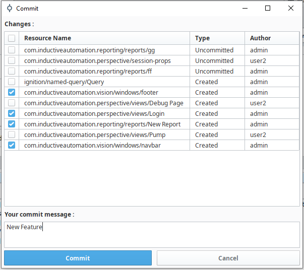
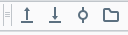
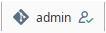

# Ignition Git Module 

Integrated git client in free Ignition module.

## Presentation

The Git module is an Ignition module embedding a Git client to make its integration easier into Ignition project development. 
It permits to manage project resources throughout the development process in the Ignition designer.  
Exporting gateway configuration is simplified or even automated.

## Features

- Link an Ignition project with a remote repo, (Gateway Webpage)
- Link an Ignition user to a git project, with ssh or user/password authentication, (Gateway Webpage)
- Commit resources, (Designer, on project saved or from git toolbar)
- Push & Pull resources, (Designer, from git toolbar)
- Export of the gateway configuration. Tags, images, theme... (Designer, from git toolbar)
- Commit popup : 

- Toolbar : 

- Status Bar : 

## Module Documentation
You can find the documentation of the module [HERE](https://www.axone-io.com/Files/Modules/GIT/1.0.0/doc/index.html), depending on its version.

You will also find a download link to the signed version of the module.

## Installation for development
### Prerequisites

Before installing and running this project on your local machine, make sure you have installed the following :

- Java (OpenJDK version 16.0.1)
- Maven
- Java IDE (I recommend [Intellij](https://www.jetbrains.com/idea/download/))

If you are using Intellij, maven is already integrated in the IDE and you can easily download the right Java SDK from your project settings.

### Installation Instructions

To install and run this project on your local machine, follow these steps :

1. Clone the repo to your local machine: `git clone https://github.com/your-username/your-project.git`.
2. Open the project in your preferred IDE.
3. Build the project using Maven by running the following command: mvn clean package.
4. Install the module on your gateway.

That's it ! You're ready to start working with the project on your local machine.

## Roadmap

- Branch management,
- Project options for select which resources export on ExportGatewayConfig :
  - Tags, which tag provider, which folder…
- Timestamp changes in commit popup,
- Status page :
  - List commit,
  - Repos state.
- SideDesignerBar for commit management like VisualStudioCode,
- Find a way to find out who deleted the resources,
- Vision project management :
  - Auto export bin file to xml.
- Make it impossible to create the same ignition user twice for the same project.

## Contributing

We're thrilled that you want to contribute to this project ! 
Here are a few steps to get started :
- Fork the repo and clone your fork to your local machine.
- Create a branch for your feature : git checkout -b feature/describe-your-feature.
- Make your changes or add the new feature.
- Commit your changes, clearly explaining what you did : git commit -m "Added a new feature: describe your feature".
- Push your changes to your fork : git push origin feature/describe-your-feature.
- Open a pull request, explaining the changes you made and why they should be included in the project.

We'll review your contribution as soon as possible and provide feedback. 
Thanks for participating !

## Contact

Enzo Sagnelonge - e.sagnelonge@axone-io.com

AXONE-IO - contact@axone-io.com - https://www.axone-io.com/

## License

This project is licensed by Beerware. Please see the LICENSE.md file for more information.
